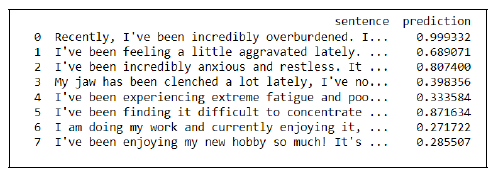
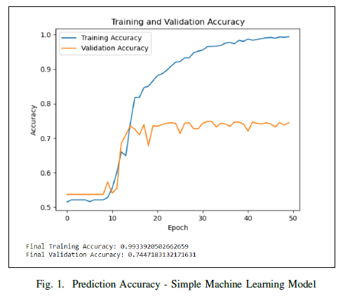
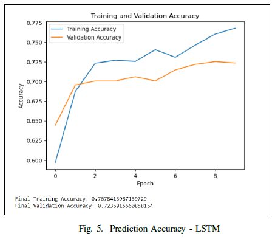

##  Decoding Emotions: Predicting Human Stress Levels through Sentiment Analysis of Textual Data

### Project Summary:

In an increasingly complex world, understanding an individual's mental state and addressing stress levels have become crucial for overall well-being. This study aims to predict stress levels through sentiment analysis of textual data, utilizing both conventional machine learning models and deep learning techniques. The research explores Support Vector Machines (SVMs), Naive Bayes (NB), Decision Trees (DT), and Long Short-Term Memory (LSTM) networks. The objective is to create personalized stress management strategies and improve mental health support, benefiting mental health specialists, practitioners, and social media platforms.

### What it does: 

The project aims to categorize stress levels, ranging from no stress to full stress, based on textual data and the sentiments conveyed in the input messages. The LSTM model achieved impressive accuracy, making accurate predictions.

### Technologies Used: 

This project employs machine learning models including SVMs, NB, DT, and LSTM networks for stress level prediction. It involves processing textual data and sentiment analysis.

### Results:

As seen in the above image, the prediction values for conventional machine learning model is not accurate, there is a huge inaccuracy in the training and final predication accuracy.

The LSTM model achieved a training accuracy of 76% and a validation/prediction accuracy of 72%. It accurately categorizes stress levels, ranging from no stress to less stress (0.1-0.5) and more or full stress (0.6-0.9) based on textual data and sentiment analysis.

 ### Conclusion: 
 
 Accurate stress level predictions have the potential to significantly improve mental health by enabling personalized stress management techniques and early intervention. Healthcare professionals and support services can use these predictions to offer tailored medical and mental assistance. Integrating the stress detection model into preliminary checks can help identify signs of stress early. Social media platforms can leverage this algorithm to improve users' well-being by providing personalized content and creating a supportive online community. Ultimately, this research contributes to enhancing mental well-being through the intersection of technology and mental health.
